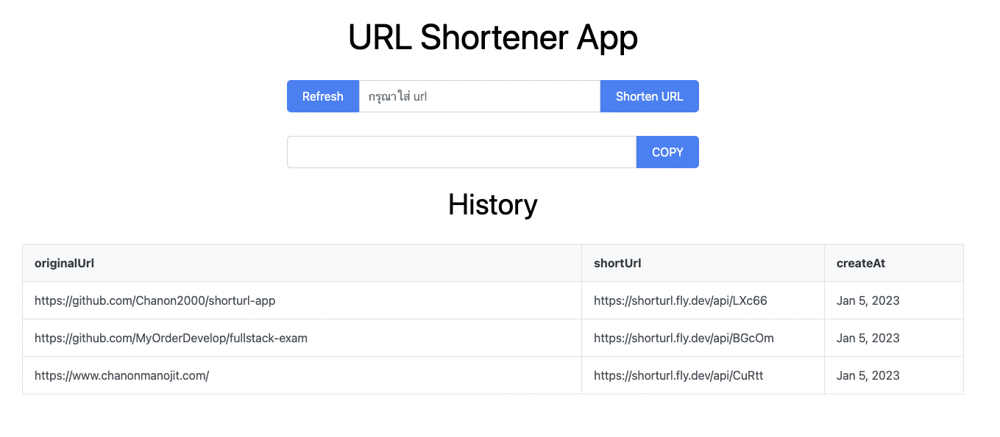

## **This App use**
- NodeJs + Express + Mongoose
- Angular + Nginx + PrimeNG (css framework)
- MongoDB
- fly (deployment cloud) + MongoDB Atlas (database cloud)
- Docker (build and run app)

## **Deployment**
- [Frontend shortener-url App](https://shortener-url-app.fly.dev/) => ที่ [fly.io](https://fly.io/)
- [Backend shortener-url App](https://shorturl.fly.dev/) => ที่ [fly.io](https://fly.io/)
- MongoDB Database => อยู่ที่ [MongoDB Atlas](https://www.mongodb.com/cloud/atlas/register)

## **For run the project**

##### For running on localhost
- `ng serve` (frontend directory)
- `npm run start:dev` (backend directory)
##### For running on Docker in localhost
- `docker-compose up`

## **ตอบคำถาม Fullstack Exam**
#### ตอบข้อ 1
Flow หลักของ App นี้คือ ให้ user สามารถใส่ url ที่ต้องการจะย่อ เมื่อใส่เข้าไปในระบบ ระบบจะทำการ สร้าง url ใหม่ที่เล็กลง โดยระบบจะเอา domain ของ api มาร่วมสร้างด้วย เมื่อสร้างเสร็จก็จะเก็บข้อมูลนี้ลง database จากนั้นก็จะส่ง url ใหม่นี้ให้กับ user ที่ frontend และเมื่อ user ดังกล่าวทำการยิง url ใหม่นี้บน browser ก็จะเป็นการ ยิงไปที่ api ของ backend เพื่อทำการ redirect ไปที่ original url ที่เก็บอยู่ใน database ให้เรา

อธิบาย tools ต่างๆที่ใช้
- Database = ที่ใช้คือ MongoDB เพราะเป็น Nosql ทำให้ยืดหยุ่นในการพัฒนา และมี Cloud ฟรีเช่น MongoDB Atlas ให้ด้วย
- Back-end = ที่ใช้คือ NodeJs เพราะ มีตัว object modeling อย่าง mongoose ที่ใช้กับ Nosql database ได้ เป็น javascript ทำให้ง่ายต่อการพัฒนาทั้ง frontend และ backend และ มี libraries ให้ใช้เยอะ
- Front-end = ใช้เป็น Angular เพราะมี tools ต่างๆครบในตัวทำให้ไม่ต้อง install tools อื่นๆเพิ่มเยอะ
- Deployment = ใช้ cloud เป็น fly.io เพื่อ deploy และรัน application, และใช้ mongoDB Atlas เป็น cloud database หลักๆที่ใช้คือเพราะว่ามันฟรีในกรณีนี้ และอย่างตัว fly.io มันสามารถ deploy โดยใช้ docker ได้ ทำให้มีความยืดหยุ่นในการ deploy มากกว่าตัวอื่น ครับ

#### ตอบข้อ 2
##### 1. บอกขั้นตอนคร่าวๆในการ serve webpages อย่างง่าย ที่ Linux server (ที่อยู่บน cloud เป็นต้น) เราสามารถทำได้อย่างไร?
- `yum install httpd` → install package ชื่อ httpd
- `vi /etc/httpd/conf/httpd.conf` → แก้ไขหรือตรวจสอบ parameter ต่างๆเหล่านี้ให้มีค่าเป็นดังนี้ `ServereRoot "/etc/httpd"`, `Listen 80`, `DocumentRoot "/var/www/html"`
- สร้าง `index.html` file ที่ `/var/www/html/` directory หรือก็คือ เว็บไซต์ของคุณ
- `systemctl start httpd` → เปิดใช้งาน httpd service ที่จะเป็น service ในการ serve web ของคุณ ในระบบ
- `firewall-cmd --add-service=http --permanent` → เพื่อเพิ่ม httpd service เข้า firewall เพื่ออนุญาติ request เข้ามาได้, `--permanent` คือจะอนุญาติแบบถาวร โดยไม่ให้ปิดตัวเมื่อ reload
- จากนั้นเมื่อพิมพ์ public ip ที่ browser มันก็จะ serve `index.html` file ให้คุณทันที 😀

##### 2. จงอธิบาย docker command ต่อไปนี้ `docker run -d --rm -p 3000:80 --name feedback-app -v data:/app/data -v “/CODE/feedback-main-app:/app:ro”  feedback-node:v1`
- `docker run` สั่ง รัน image ชื่อ feedback-node:v1
- `-d` คือ ให้รันใน detach mode เพื่อที่ process ของ container จะได้ไม่มาอยู่ที่ terminal
- `--rm` คือลบ container เลยหลังจาก stop
- `-p` เพื่อทำการกำหนด port ระหว่าง localhost กับ container โดยในที่นี้คือ localhost คือ port 3000 ส่วน container คือที่ 80
- `--name feedback-app` ตั้งชื่อ container ว่า feedback-app
- `-v data:/app/feedback` กำหนดชื่อ volume ว่า data และ path ใน container คือ /app/data เพื่อให้ data ที่คุณเก็บเอาไว้ใน  /app/data มันยังอยู่แม้เราจะ stop container ไป
- `-v “/CODE/feedback-main-app:/app:ro”` → คือการทำ bind mount เพื่อให้ code ที่เราแก้ที่ localhost ไป update ที่ container ด้วย ซึ่งช่วยทำให้เราไม่ต้อง restart container บ่อยๆ โดย `:ro` คือเพื่อไม่ให้ code ที่เปลี่ยนแปลงใน container มาเขียนที่ localhost
จะเห็นว่า docker command ยาวมาก คนส่วนใหญ่เลยใช้ docker-compose ครับ

##### 3. อธิบาย Linux command นี้ `chmod ugo+r xyz.txt` ว่ามีความหมายว่าอย่างไร ?
ทำการรันเพื่อให้ permission การ read (อ่าน) ไฟล์ชื่อ `xyz.txt` ให้กับทั้ง user, group, other ซึ่งสามารถเขียนได้อีกแบบคือ `chmod 444 xyz.txt` ซึ่งเป็นการกำหนดโดยใช้ตัวเลข

